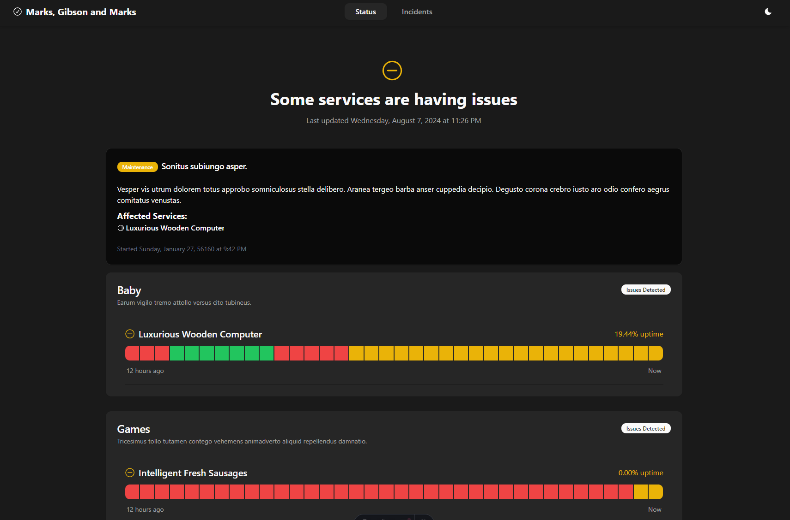

# Open Source Status Page


This project uses BunJS, Astro, React, Tailwind, and ShadcnUI.

[Live Demo](https://status.timmygstudios.com/)

## Installation and Setup

1. Clone the repository:
    ```bash
    git clone https://github.com/tommy141x/os-status-page.git
    ```
2. Navigate to the project directory:
    ```bash
    cd os-status-page
    ```
3. Install dependencies (If using docker, this is not needed):
    ```bash
    bun install
    ```
4. Rename `config.example.yml` to `config.yml` and fill in the values if needed (change the secret to something else, it's for storing session cookies). You can edit everything else in the config on the web UI.
5. Run the project:
    ```bash
    bun start
    ```
   or, if you prefer Docker:
    ```bash
    docker-compose up
    ```

## Features

- **Service Monitoring:** Checks response codes of URLs at configurable intervals with a configurable data retention time/history.
- **Charts:** Response times are recorded and displayed on charts.
- **Incident Management:** Supports incidents of type 'incident' or 'maintenance' with a description and a list of affected services.
- **User Roles:** Admins have full access to the settings, while Managers can only manage incidents.
- **Dark/Light Mode:** The status page supports both dark and light modes.



## Motivation

I created this project because I couldn't find a lightweight status page that was super simple and easy to set up. Additionally, I wanted to try out BunJS and React, as I've never made a full React project before, and I've never used Tailwind.

## Contributing

Contributions to this project are encouraged and appreciated. Please feel free to submit pull requests or open issues if you encounter any problems or have suggestions for improvements.

## License

This project is open source and available under the [Creative Commons Attribution-ShareAlike 4.0 International License](LICENSE).
